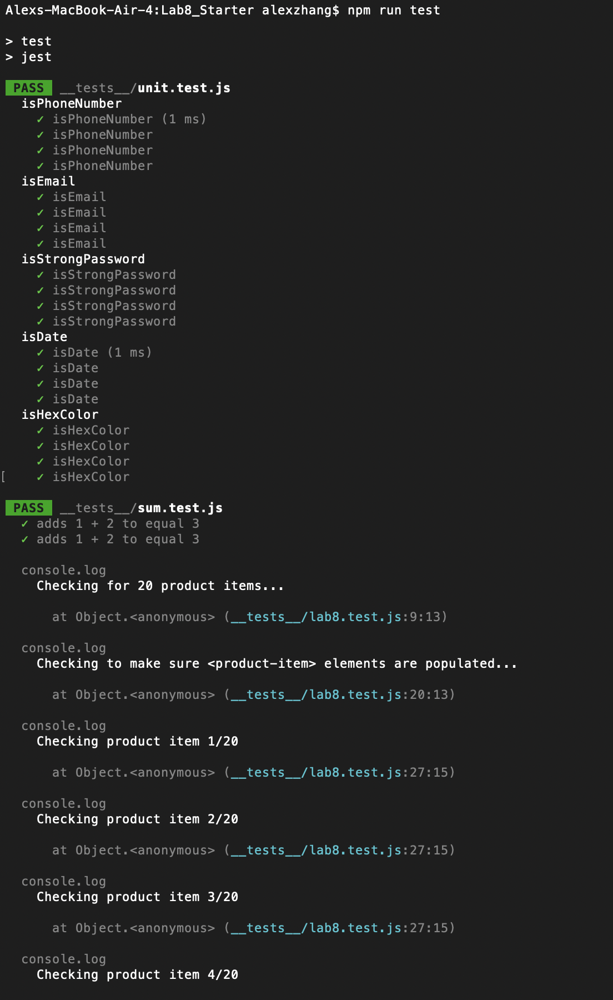
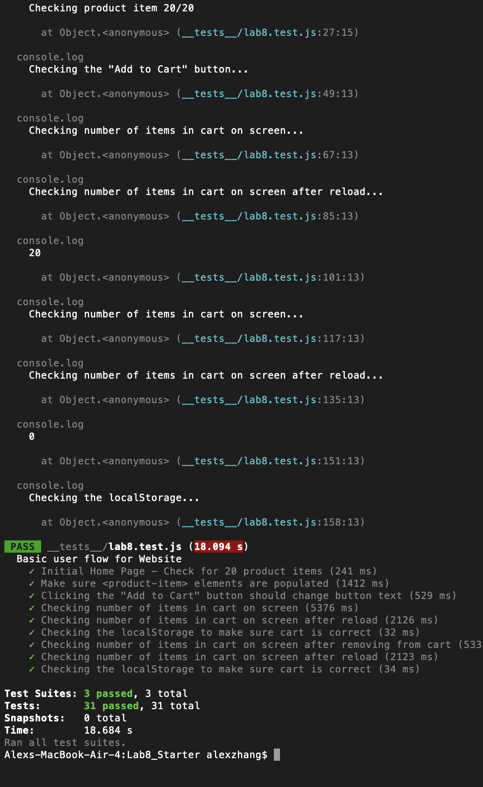

# Lab 8 - Starter
Alex Zhang

1) I would put the automated tests in a GitHub action (1) that runs whenever code is pushed so tests are run automatically and are consistently run while working on the repository.
2) You would not use an end-to-end test to check if a function is returning the correct output because you could just directly test the function without emulating user actions.
3) An end-to-end test would be more useful to test the messaging feature of an application because a unit test isn't able to verify if the message is received or correctly displayed.
4) A unit test would be good to test the max messaging length because the function can be called and checked to see if it correctly caps the message limit.

